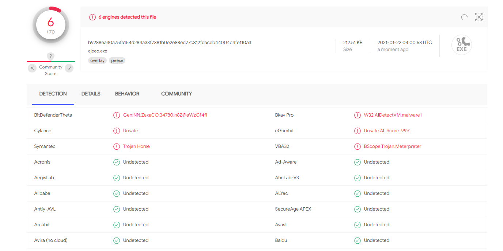
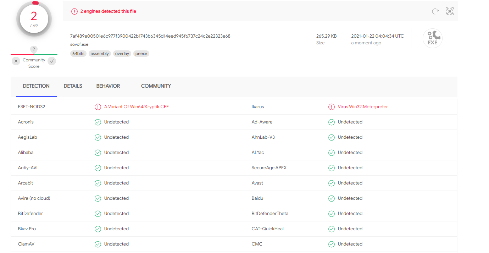

# BypassAv-web
nim一键免杀源码
仅限用于技术研究和获得正式授权的测试活动。

使用nim语言进行shellcode加载，使用时需要选择i386和AMD64
## 使用方法
cs attacks - packages - payload generator 
output 选择Raw（勾选x64时web页面上需要选择AMD64）

## 已知问题
- [ ] windows 2008(不包含r2 sp2 等)无法运行，推测缺少vc++ 运行库
## 本地使用
安装nim
安装nim winim模块

## 项目结构
code nim源代码
其余为web代码

## 在线地址
http://192.168.161.10:8000/

## 页面

## vt查杀
### i386

### AMD64

## 功能
- [x] 窗口隐藏
- [x] 自动加密
- [x] 虚拟机检测

## 实现
使用纯nim语言编写的shellcode记载器，代码基本是从之前c++版本平移过来。
